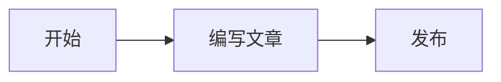

在这里写文章摘要或开场内容。

## 小节标题

在这里继续写正文。完成后：

1. 将文件重命名为英文短横线格式，例如 `my-first-post.md`。
2. 修改 frontmatter 中的标题、摘要、日期和标签。
3. 删除 `draft: true` 或改为 `draft: false`。

执行 `npm run dev` 或 `npm run build` 后，Astro 会自动生成 `/blog/my-first-post/` 页面。

## Mermaid 图表

使用标记为 `mermaid` 的代码块，文章页会自动将其渲染为图表：

