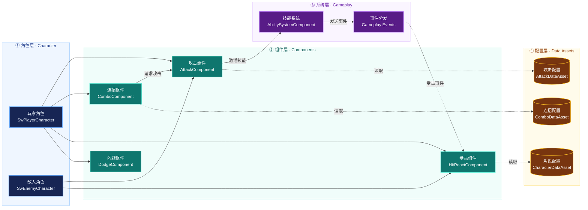

## 什么是组件化

组件化是把具有明确状态、行为和生命周期的一项能力交给可挂在宿主 Actor 上的组件。

以门为例，若需求是“普通门、上锁门、计时门、可破坏门、需要钥匙的计时可破坏门”，靠子类逐项排列，很容易导致子类爆炸。因此可引入组件化思想：

- `ADoor` 表示世界中的门及其网格/动画
- `ULockComponent` 管理锁的判定与状态
- `UHealthComponent` 管理受伤与死亡

## 源码角度查看组件工作原理

### 1. 默认组件与运行时组件

UObject::CreateDefaultSubobject 是构造函数内声明默认子对象的入口。

```cpp
Lock = CreateDefaultSubobject<ULockComponent>(TEXT("Lock"));
```

运行时动态添加与之不同：NewObject 先创建 UObject，之后还要考虑 Actor 的实例组件记录、注册、移除及网络。一个常见流程是：

```cpp
// Owner 是已经存在于 World 的 Actor。
ULockComponent* Lock = NewObject<ULockComponent>(Owner);
Owner->AddInstanceComponent(Lock);
Lock->RegisterComponent();
// 不再需要时由拥有者调用 Lock->DestroyComponent()，并清理外部订阅。
```

`AActor::AddInstanceComponent` 设置 `CreationMethod::Instance` 并添加进 `InstanceComponents`；注册阶段会先检查Owner所在的 ` UWorld ` 是否有效，再调用 `RegisterComponentWithWorld`；`RegisterComponentWithWorld`检查对象有效、是否已经注册和 World 是否存在。

### 2. BeginPlay 的实际门槛

AActor::BeginPlay 遍历组件，只对 IsRegistered() 且尚未 HasBegunPlay() 的组件调用 BeginPlay，可见：

```cpp
for (UActorComponent* Component : Components)
{
    // bHasBegunPlay will be true for the component if the component was renamed and moved to a new outer during initialization
    if (Component->IsRegistered() && !Component->HasBegunPlay())
    {
        Component->RegisterAllComponentTickFunctions(true);
        Component->BeginPlay();
        ensureMsgf(Component->HasBegunPlay(), TEXT("Failed to route BeginPlay (%s)"), *Component->GetFullName());
    }
}
```

若 Actor 已开始 Play，后来注册的组件则走UActorComponent::RegisterComponentWithWorld-> AActor::HandleRegisterComponentWithWorld 的初始化与 BeginPlay 路径。

```cpp
void AActor::HandleRegisterComponentWithWorld(UActorComponent* Component)
{
	const bool bOwnerBeginPlayStarted = HasActorBegunPlay() || IsActorBeginningPlay();

	if (!Component->HasBeenInitialized() && Component->bWantsInitializeComponent && IsActorInitialized())
	{
		Component->InitializeComponent();

		// The component was finally initialized, it can now be replicated
		// Note that if this component does not ask to be initialized, it would have started to be replicated inside AddOwnedComponent.
		if (bOwnerBeginPlayStarted && Component->GetIsReplicated())
		{
			AddComponentForReplication(Component);
		}
	}

	if (bOwnerBeginPlayStarted)
	{
		Component->RegisterAllComponentTickFunctions(true);

		if (!Component->HasBegunPlay())
		{
			Component->BeginPlay();
			ensureMsgf(Component->HasBegunPlay(), TEXT("Failed to route BeginPlay (%s)"), *Component->GetFullName());
		}
	}
}
```

### 3. 生命周期

Actor 会维护它所持有的组件。在 Actor 的 BeginDestroy 方法中，它会调用 UnregisterAllComponents。在这个方法里面，它会逐个遍历 Actor 所持有的这个组件，并调用每个组件的 UnregisterComponent ，这个方法会解除注册事件/Tick；。

```cpp
void UActorComponent::UnregisterComponent()
{
	SCOPE_CYCLE_COUNTER(STAT_UnregisterComponent);
	FScopeCycleCounterUObject ComponentScope(this);

	// Do nothing if not registered
	if(!IsRegistered())
	{
		UE_LOG(LogActorComponent, Log, TEXT("UnregisterComponent: (%s) Not registered. Aborting."), *GetPathName());
		return;
	}

	// If registered, should have a world
	checkf(WorldPrivate != nullptr, TEXT("%s"), *GetFullName());

	RegisterAllComponentTickFunctions(false);
	ExecuteUnregisterEvents();

	WorldPrivate = nullptr;
}
```

DestroyComponent 是结束该组件的语义入口。外部如果订阅了它的委托，仍应按业务协议解绑；GC 和组件注销不会替 UI 决定下一个数据源。

## 数据驱动：DataAsset 与类默认值各管什么

UDataAsset 是存放某系统数据的资产，可由原生派生类在内容浏览器创建。需要 AssetManager 主资产 ID、资产包或明确加载/卸载管理时，才进一步考虑 UPrimaryDataAsset。

> 这里补充一下二者区别：
>
> - `UDataAsset` 用于存储配置数据；
> - `UPrimaryDataAsset` 在此基础上提供了接入 `UAssetManager` 主资产管理体系的默认实现。
>
> **1. 主资产 ID（Primary Asset ID）**
>
> `UPrimaryDataAsset` 默认提供 `FPrimaryAssetId`，由资产类型（Type）和名称（Name）组成。
>
> 例如 `Equipment:DA_Sword`，AssetManager 可以通过该 ID 查找和加载已注册的资产，而不需要调用方直接持有资产引用或路径。
>
> 
>
> **2. 资产包（Asset Bundle）**
>
> Asset Bundle 用于将主资产引用的资源按用途分组，实现按需加载。
>
> ```cpp
> UPROPERTY(EditDefaultsOnly, meta=(AssetBundles="UI"))
> TSoftObjectPtr<UTexture2D> Icon;
> 
> UPROPERTY(EditDefaultsOnly, meta=(AssetBundles="Game"))
> TSoftObjectPtr<USkeletalMesh> WeaponMesh;
> ```
>
> 例如打开背包时只加载 `UI` 组的图标，实际装备时再加载 `Game` 组的模型，减少不必要的资源加载。
>
> 
>
> **3. 加载与卸载管理**
>
> AssetManager 提供统一的资源生命周期管理接口：
>
> - `LoadPrimaryAsset()`：加载主资产及指定 Bundle。
> - `ChangeBundleStateForPrimaryAssets()`：调整已加载的资源组。
> - `UnloadPrimaryAsset()`：释放 AssetManager 对主资产的加载保持。
>
> 注意：卸载不代表立即销毁资源。如果仍存在硬引用，资源可能继续驻留内存。
>
> 
>
> **总结**
>
> - `UDataAsset`：适合移动参数、攻击配置等普通静态数据。
> - `UPrimaryDataAsset`：适合装备、物品、角色配置等需要按 ID 查找、分组加载或统一管理生命周期的资产。

类默认对象（CDO）是另一种配置来源。UClass::GetDefaultObject 返回类默认对象；蓝图子类可覆盖默认属性。

对于“每种门一个稳定的类及默认网格/组件结构”，蓝图子类默认值已经合适。对于“同一种门逻辑有许多可复用配置，并希望配置作为独立资产引用、审查或替换”，DataAsset 更合适。

```cpp
UCLASS(BlueprintType)
class UDoorDefinition : public UDataAsset
{
    GENERATED_BODY()
public:
    UPROPERTY(EditDefaultsOnly, BlueprintReadOnly)
    float InteractionRange = 200.f;

    UPROPERTY(EditDefaultsOnly, BlueprintReadOnly)
    bool bStartsLocked = false;
};

// ADoor 内：配置引用和每个门自己的运行状态分开。
UPROPERTY(EditDefaultsOnly, Category="Door")
TObjectPtr<UDoorDefinition> Definition;

UPROPERTY(VisibleInstanceOnly, Category="Door")
bool bIsOpen = false;
```

### 何时不适合组件化？

判断组件是否合适，可问四个问题：

1. 组件对外能否用 2～5 个稳定操作解释？还是外部必须反复读写它的内部字段？
2. 它能否独立维护一个不变量，如血量范围、背包容量、锁状态？
3. 换一个宿主仍能成立吗？若到处 `Cast<ADoor>(GetOwner())`，很可能只是把门代码搬到了组件里。

### 职责分明的示例


